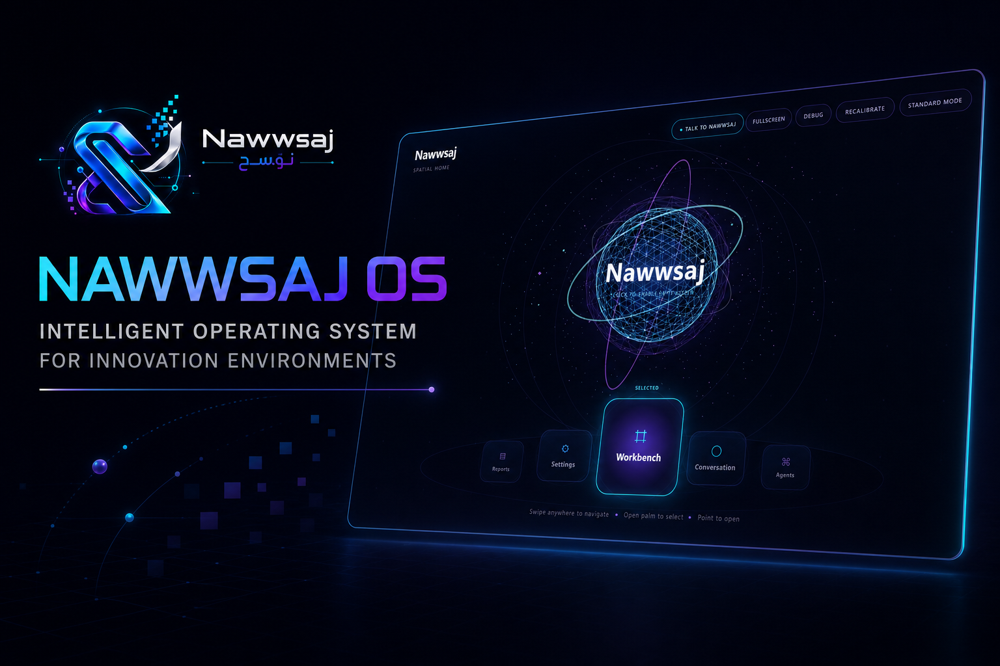
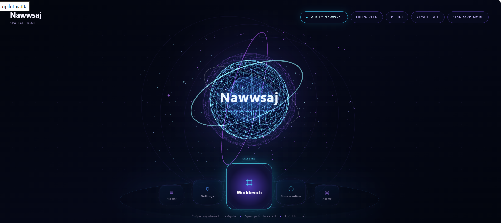
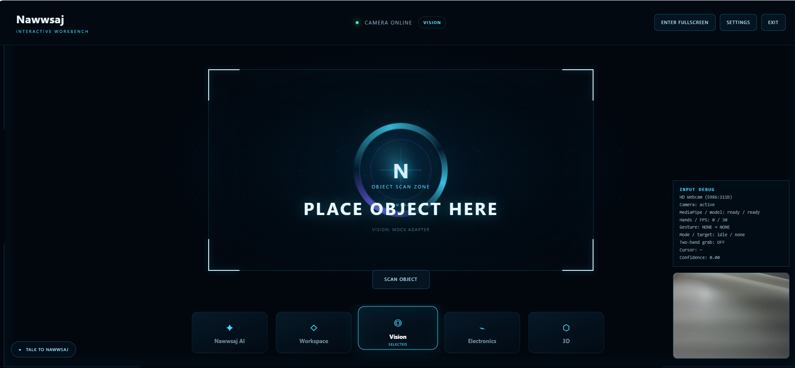

# Nawwsaj Innovation Lab

An innovation and technology development lab for turning ideas and operational challenges into testable products, prototypes, and connected systems.

## Overview

Nawwsaj is an innovation and technology development lab founded by **Afnan Al-Duhaim**. It provides a hands-on environment for moving from an early idea or an unclear problem to a working prototype, MVP, or technology product that can be tested and evaluated.

The lab brings product thinking together with software, AI, automation, hardware, and emerging technologies.

## What Nawwsaj Builds

- AI-enabled products
- Automation workflows
- Connected systems
- IoT prototypes
- Rapid MVPs
- Technology experiments and proofs of concept

## Nawwsaj OS

**Nawwsaj OS** is the operating layer within the lab. It is designed to connect AI agents, automation, connected devices, and interactive tools in one innovation workspace.

The current product presentation explores:

- A unified spatial interface for the lab
- AI-agent and automation integration
- Connected-device workflows
- An interactive workbench for building and testing ideas

## Technology

The current repository uses:

- Next.js 16
- React 19
- TypeScript
- Tailwind CSS 4
- Vinext and Vite
- Drizzle ORM with optional Cloudflare D1 support

## Screenshots

### Nawwsaj OS

### Spatial workspace

### Interactive workbench

## Live Demo

[Visit the live Nawwsaj website](https://nawwsaj-site.vercel.app)

## Founder

**Afnan Al-Duhaim** 
Technology Product Builder 
[View Afnan's portfolio](https://afnan-ahmad-portfolio.vercel.app)

## Status

Active development.
